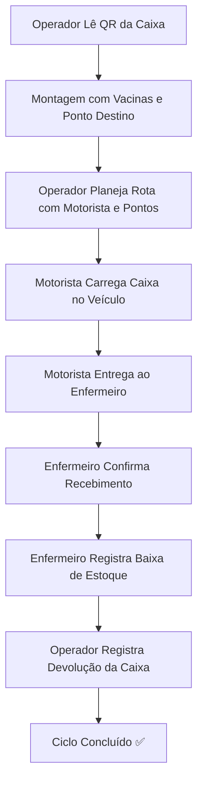
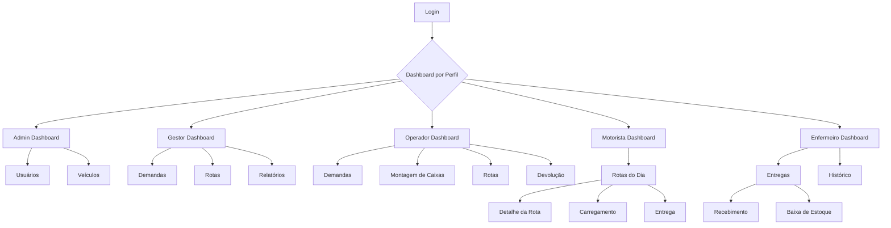

## 1. Visão Geral do Produto
Sistema de logística especializado na distribuição de vacinas com rastreamento em tempo real via QR Code e monitoramento geográfico.
- Resolve o problema de gestão complexa da cadeia de frio de vacinas, desde a montagem até a aplicação.
- Utilizado por hospitais, postos de saúde e órgãos de saúde pública para otimizar a distribuição de vacinas.
- Oferece controle total sobre o ciclo de vida das caixas de vacinas com auditoria completa.

## 2. Funcionalidades Principais

### 2.1 Papéis dos Usuários
Distinção clara de perfis com permissões e fluxos específicos para cada tipo de usuário.

| Papel | Método de Registro | Permissões Principais |
|------|-------------------|----------------------|
| Administrador | Cadastro manual via Admin | Gerenciar todos os usuários, veículos e configurações do sistema |
| Gestor | Cadastro via Admin ou convite | Visualizar dashboards, gerenciar demandas, rotas e relatórios |
| Operador | Cadastro via Admin | Montar caixas, planejar rotas, gerenciar devoluções |
| Motorista | Cadastro via Admin | Visualizar rotas do dia, registrar carregamento e entrega de caixas |
| Enfermeiro | Cadastro via Admin | Confirmar recebimento, registrar baixa de estoque, ver histórico |

### 2.2 Módulos de Funcionalidade
Nossos requisitos consistem nas seguintes páginas principais:
1. **Página de Login**: autenticação por email/senha com redirecionamento por perfil.
2. **Dashboard Admin**: visão geral do sistema, gestão de usuários e veículos.
3. **Dashboard Gestor**: visão operacional, gestão de demandas, rotas e relatórios.
4. **Página de Demandas (Operador)**: listagem e criação de novas demandas de vacinação.
5. **Página de Montagem de Caixas (Operador)**: montagem física com leitura de QR Code e associação de vacinas.
6. **Página de Rotas (Operador)**: planejamento de rotas com pontos de entrega e motoristas.
7. **Página de Devolução (Operador)**: registro de devolução de caixas à base.
8. **Página de Rotas do Dia (Motorista)**: visualização das rotas atribuídas.
9. **Página de Detalhe da Rota (Motorista)**: mapa interativo com pontos de entrega.
10. **Página de Carregamento (Motorista)**: registro de carregamento de caixas no veículo.
11. **Página de Entrega (Motorista)**: registro de entrega ao enfermeiro com geolocalização.
12. **Página de Entregas (Enfermeiro)**: lista de entregas recebidas para confirmação.
13. **Página de Recebimento (Enfermeiro)**: confirmação de recebimento da caixa.
14. **Página de Baixa de Estoque (Enfermeiro)**: registro de doses aplicadas e residuais.
15. **Página de Histórico (Enfermeiro)**: histórico pessoal de entregas processadas.

### 2.3 Detalhamento das Páginas

| Nome da Página | Nome do Módulo | Descrição da Funcionalidade |
|----------------|----------------|-----------------------------|
| Login | Autenticação | Validar credenciais via Supabase Auth e redirecionar conforme perfil do usuário |
| Dashboard Admin | Visão Geral | Exibir métricas do sistema, contagens de usuários ativos, veículos e demandas |
| Dashboard Admin | Gerenciamento de Usuários | Listar, criar, editar e inativar usuários com diferentes perfis |
| Dashboard Admin | Gerenciamento de Veículos | Cadastrar veículos (placa, modelo, tipo, capacidade) e gerenciar status |
| Dashboard Gestor | Visão Operacional | Mostrar cards com demandas do dia, caixas por status, rotas em andamento |
| Dashboard Gestor | Gestão de Demandas | Criar novas demandas com cliente, data entrega, prazo e pontos de entrega |
| Dashboard Gestor | Mapa de Rotas | Visualizar rotas em tempo real com pontos coloridos por status no mapa |
| Dashboard Gestor | Relatórios | Gerar relatórios de baixa de estoque por período com filtros |
| Demandas (Operador) | Listagem | Listar demandas recebidas e em andamento ordenadas por prazo limite |
| Demandas (Operador) | Detalhes | Visualizar detalhes da demanda com pontos de entrega associados |
| Montagem de Caixas (Operador) | Leitura QR | Ativar leitor de câmera para ler QR Code da caixa física |
| Montagem de Caixas (Operador) | Associação | Vincular caixa à demanda específica e ponto de entrega |
| Montagem de Caixas (Operador) | Registro de Vacinas | Adicionar tipos de vacina e quantidades de doses enviadas |
| Rotas (Operador) | Planejamento | Criar nova rota associando motorista, veículo e pontos ordenados |
| Rotas (Operador) | Visualização Mapa | Ver rota no mapa com ordem numérica dos pontos |
| Devolução (Operador) | Registro | Ler QR Code da caixa devolvida e atualizar status para "devolvida" |
| Rotas do Dia (Motorista) | Listagem | Mostrar rotas atribuídas para o dia atual com status e veículo |
| Detalhe da Rota (Motorista) | Mapa Interativo | Exibir rota completa com marcadores numerados e linha de conexão |
| Detalhe da Rota (Motorista) | Status Pontos | Atualizar status de cada ponto (pendente/entregue/pulado) |
| Carregamento (Motorista) | Registro | Ler QR Code da caixa e registrar carregamento no veículo |
| Entrega (Motorista) | Registro | Ler QR Code, registrar entrega ao enfermeiro com geolocalização |
| Entregas (Enfermeiro) | Listagem | Listar entregas recebidas ordenadas por data com status |
| Recebimento (Enfermeiro) | Confirmação | Confirmar recebimento da caixa e registrar data/hora |
| Baixa de Estoque (Enfermeiro) | Registro | Inserir doses aplicadas e residuais para cada tipo de vacina |
| Histórico (Enfermeiro) | Consulta | Visualizar histórico pessoal de entregas e baixas processadas |

## 3. Processos Principais

### 3.1 Fluxo do Administrador
1. Login → Dashboard Admin → Gerenciar Usuários (criar/editar) → Gerenciar Veículos → Monitorar métricas

### 3.2 Fluxo do Gestor
1. Login → Dashboard Gestor → Criar Nova Demanda → Adicionar Pontos de Entrega → Monitorar Rotas → Gerar Relatórios

### 3.3 Fluxo do Operador
1. Login → Demandas → Selecionar Demanda → Montar Caixas (QR + vacinas) → Planejar Rota (motorista + pontos) → Registrar Devoluções

### 3.4 Fluxo do Motorista
1. Login → Rotas do Dia → Selecionar Rota → Ver Detalhes no Mapa → Carregar Caixas (QR) → Entregar aos Pontos (QR + geolocalização)

### 3.5 Fluxo do Enfermeiro
1. Login → Entregas Recebidas → Confirmar Recebimento (QR) → Registrar Baixa de Estoque (doses aplicadas) → Ver Histórico

### 3.6 Fluxo Completo de uma Caixa

### 3.7 Navegação entre Páginas

## 4. Design da Interface do Usuário

### 4.1 Estilo de Design
- **Cores primárias**: Azul hospitalar (#1E88E5) para ações principais, Verde (#4CAF50) para sucesso, Vermelho (#F44336) para alertas
- **Cores secundárias**: Cinza claro (#F5F5F5) para fundos, Cinza escuro (#424242) para texto
- **Estilo de botões**: Cantos arredondados (8px), sombra sutil, estados hover e active
- **Fonte**: 'Inter' ou 'Roboto' como fontes principais, tamanhos: 14px corpo, 16px subtítulos, 24px títulos
- **Layout**: Navegação lateral fixa com menu por perfil, barra superior com título e notificações
- **Ícones**: Material Icons ou FontAwesome para ações e status
- **Cards**: Bordas arredondadas, sombra suave, espaçamento interno consistente

### 4.2 Visão Geral do Design das Páginas

| Nome da Página | Nome do Módulo | Elementos de UI |
|----------------|----------------|-----------------|
| Login | Formulário | Card centralizado, campo email, campo senha, botão "Entrar", logo do sistema |
| Dashboard Admin | Métricas | Grid de cards com ícones e números, tabelas de usuários e veículos com ações |
| Dashboard Admin | Tabela Usuários | Colunas: Nome, Email, Perfil, Status, Ações (editar/inativar) |
| Dashboard Admin | Tabela Veículos | Colunas: Placa, Modelo, Tipo, Capacidade, Status, Ações |
| Dashboard Gestor | Cards Operacionais | 4 cards: Demandas Hoje, Caixas Montadas, Rotas Ativas, Atrasos |
| Dashboard Gestor | Mapa | Mapa Leaflet ocupando 70% da tela, marcadores coloridos, legenda de status |
| Montagem de Caixas | Leitor QR | Modal fullscreen com visualização da câmera, área de foco central, feedback visual |
| Montagem de Caixas | Formulário | Campos: Demanda (select), Ponto Entrega (select), Tabela de vacinas com quantidades |
| Rotas (Operador) | Planejamento | Formulário com selects: Motorista, Veículo, Demanda; Lista arrastável de pontos |
| Rotas (Operador) | Visualização | Mapa com marcadores numerados, linha de conexão, painel lateral com ordem |
| Detalhe da Rota (Motorista) | Mapa | Mapa interativo com localização atual, marcadores clicáveis, botão "Cheguei" |
| Entrega (Motorista) | Registro | Leitor QR, botão "Usar Localização Atual", campo para selecionar enfermeiro |
| Baixa de Estoque (Enfermeiro) | Formulário | Tabela com: Tipo de Vacina, Doses Enviadas, Doses Aplicadas, Doses Residuais, Diferença |

### 4.3 Responsividade
- **Abordagem**: Desktop-first com adaptação para tablets e mobile
- **Breakpoints**: 768px (tablet), 480px (mobile)
- **Menu lateral**: Em mobile transforma-se em gaveta deslizante
- **Mapas**: Em mobile ocupa tela cheia com controles otimizados para toque
- **Formulários**: Campos empilhados verticalmente em mobile
- **Tabelas**: Em mobile transformam-se em cards com rolagem horizontal