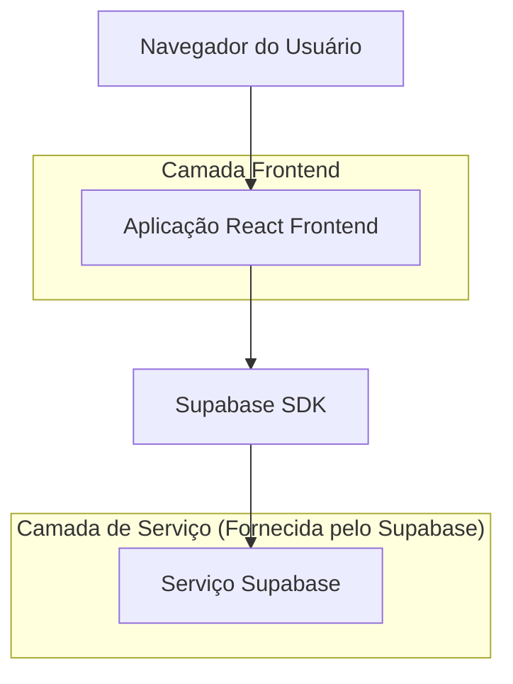
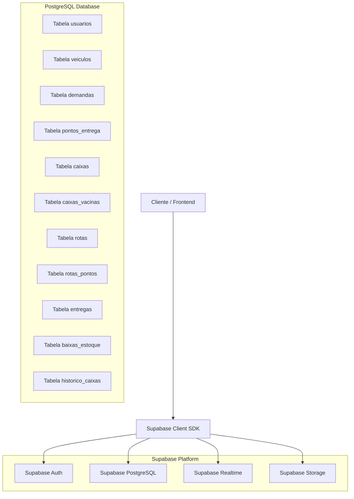

## 1. Design da Arquitetura



## 2. Descrição da Tecnologia

- **Frontend**: React@18 + Vite + React Router DOM
- **Bibliotecas de UI**: Recharts para gráficos, React Leaflet para mapas, html5-qrcode para leitura de QR Codes
- **Backend**: Supabase (PostgreSQL + Auth + Storage + Realtime)
- **Autenticação**: Supabase Auth com Row Level Security (RLS)
- **Banco de Dados**: PostgreSQL 15+ via Supabase
- **Notificações em Tempo Real**: Supabase Realtime para assinaturas
- **Deploy**: Vercel (frontend) + Supabase (backend)

## 3. Definições de Rotas

| Rota | Finalidade | Acesso |
|------|------------|--------|
| `/` | Redireciona para login ou dashboard conforme autenticação | Todos |
| `/login` | Página de autenticação com email/senha | Não autenticados |
| `/acesso-negado` | Página de erro para acesso não autorizado | Todos |
| `/admin/dashboard` | Dashboard administrativo com métricas do sistema | Admin |
| `/admin/usuarios` | Gerenciamento de usuários (CRUD) | Admin |
| `/admin/veiculos` | Gerenciamento de veículos (CRUD) | Admin |
| `/gestor/dashboard` | Dashboard operacional com cards e mapa | Gestor |
| `/gestor/demandas` | Gestão de demandas de vacinação | Gestor |
| `/gestor/rotas` | Visualização de rotas em tempo real no mapa | Gestor |
| `/gestor/relatorios` | Geração de relatórios de baixa de estoque | Gestor |
| `/operador/demandas` | Listagem de demandas para processamento | Operador |
| `/operador/montagem` | Montagem de caixas com leitura de QR Code | Operador |
| `/operador/rotas` | Planejamento de rotas com pontos ordenados | Operador |
| `/operador/devolucao` | Registro de devolução de caixas à base | Operador |
| `/motorista/rotas` | Rotas atribuídas para o dia atual | Motorista |
| `/motorista/rota/:id` | Detalhe da rota com mapa interativo | Motorista |
| `/motorista/carregamento` | Registro de carregamento de caixas no veículo | Motorista |
| `/motorista/entrega` | Registro de entrega ao enfermeiro | Motorista |
| `/enfermeiro/entregas` | Lista de entregas recebidas para confirmação | Enfermeiro |
| `/enfermeiro/recebimento` | Confirmação de recebimento da caixa | Enfermeiro |
| `/enfermeiro/baixa-estoque` | Registro de doses aplicadas e residuais | Enfermeiro |
| `/enfermeiro/historico` | Histórico pessoal de entregas processadas | Enfermeiro |

## 4. Definições de API (Integração com Supabase)

### 4.1 Autenticação

```
POST /auth/v1/token?grant_type=password
```

Request:
| Nome do Parâmetro | Tipo do Parâmetro | Obrigatório | Descrição |
|-------------------|-------------------|-------------|-----------|
| email | string | true | Email do usuário |
| password | string | true | Senha do usuário |

Response:
| Nome do Parâmetro | Tipo do Parâmetro | Descrição |
|-------------------|-------------------|-----------|
| access_token | string | Token JWT para autenticação |
| refresh_token | string | Token para renovação de sessão |
| user | object | Dados do usuário autenticado |

Exemplo
```json
{
  "email": "enfermeiro@saude.gov.br",
  "password": "senha123"
}
```

### 4.2 Consulta de Perfil do Usuário

```javascript
// Após autenticação, buscar perfil na tabela usuarios
await supabase
  .from('usuarios')
  .select('*')
  .eq('auth_id', user.id)
  .single();
```

## 5. Diagrama de Arquitetura do Servidor



## 6. Modelo de Dados

### 6.1 Definição do Modelo de Dados

```mermaid
erDiagram
    USUARIOS ||--o{ DEMANDAS : cria
    USUARIOS ||--o{ ROTAS : motorista
    USUARIOS ||--o{ CAIXAS : operador
    USUARIOS ||--o{ ENTREGAS : enfermeiro
    VEICULOS ||--o{ ROTAS : utilizado
    DEMANDAS ||--o{ PONTOS_ENTREGA : contem
    DEMANDAS ||--o{ CAIXAS : associada
    DEMANDAS ||--o{ ROTAS : atendida
    PONTOS_ENTREGA ||--o{ CAIXAS : destino
    PONTOS_ENTREGA ||--o{ ROTAS_PONTOS : incluido
    CAIXAS ||--o{ CAIXAS_VACINAS : contem
    CAIXAS ||--o{ ENTREGAS : entregue
    CAIXAS ||--o{ BAIXAS_ESTOQUE : baixada
    CAIXAS ||--o{ HISTORICO_CAIXAS : auditada
    ROTAS ||--o{ ROTAS_PONTOS : inclui
    ROTAS ||--o{ ENTREGAS : realiza

    USUARIOS {
        uuid id PK
        uuid auth_id FK
        string nome
        string email UK
        string perfil
        string telefone
        boolean ativo
        timestamp criado_em
        timestamp atualizado_em
    }
    
    VEICULOS {
        uuid id PK
        string placa UK
        string modelo
        string tipo
        integer capacidade_caixas
        boolean ativo
        timestamp criado_em
    }
    
    DEMANDAS {
        uuid id PK
        string id_demanda_origem UK
        string cliente
        date data_entrega
        timestamp prazo_limite
        string status
        integer total_pontos
        integer total_doses
        text observacao
        timestamp recebida_em
        timestamp concluida_em
        timestamp criado_em
        timestamp atualizado_em
    }
    
    PONTOS_ENTREGA {
        uuid id PK
        uuid demanda_id FK
        string local
        string endereco
        string cidade
        string estado
        string cep
        decimal lat
        decimal lng
        uuid enfermeiro_id FK
        timestamp horario_previsto
        string status
        timestamp criado_em
    }
    
    CAIXAS {
        uuid id PK
        string qr_code UK
        string status
        uuid demanda_id FK
        uuid ponto_entrega_id FK
        uuid rota_id FK
        uuid operador_id FK
        uuid motorista_id FK
        uuid enfermeiro_id FK
        timestamp montada_em
        timestamp carregada_em
        timestamp entregue_em
        timestamp devolvida_em
        text observacao
        timestamp criado_em
        timestamp atualizado_em
    }
    
    CAIXAS_VACINAS {
        uuid id PK
        uuid caixa_id FK
        string tipo_vacina
        integer doses_enviadas
        timestamp criado_em
    }
    
    ROTAS {
        uuid id PK
        uuid demanda_id FK
        uuid motorista_id FK
        uuid veiculo_id FK
        uuid operador_id FK
        string status
        timestamp data_saida
        timestamp saida_real
        timestamp conclusao_real
        integer total_pontos
        integer total_caixas
        text observacao
        timestamp criado_em
        timestamp atualizado_em
    }
    
    ROTAS_PONTOS {
        uuid id PK
        uuid rota_id FK
        uuid ponto_entrega_id FK
        integer ordem
        string status
        timestamp chegada_prevista
        timestamp chegada_real
        timestamp criado_em
    }
    
    ENTREGAS {
        uuid id PK
        uuid caixa_id FK
        uuid rota_id FK
        uuid ponto_entrega_id FK
        uuid motorista_id FK
        uuid enfermeiro_id FK
        timestamp entregue_em
        timestamp confirmado_em
        decimal lat_entrega
        decimal lng_entrega
        text observacao
        timestamp criado_em
    }
    
    BAIXAS_ESTOQUE {
        uuid id PK
        uuid caixa_id FK
        uuid enfermeiro_id FK
        string tipo_vacina
        integer doses_enviadas
        integer doses_aplicadas
        integer doses_residual
        integer diferenca GENERATED
        text observacao
        timestamp registrado_em
        timestamp criado_em
    }
    
    HISTORICO_CAIXAS {
        uuid id PK
        uuid caixa_id FK
        string status_anterior
        string status_novo
        uuid usuario_id FK
        string acao
        decimal lat
        decimal lng
        text observacao
        timestamp criado_em
    }
```

### 6.2 Linguagem de Definição de Dados (DDL)

```sql
-- 1. USUÁRIOS
CREATE TABLE usuarios (
  id UUID PRIMARY KEY DEFAULT gen_random_uuid(),
  auth_id UUID REFERENCES auth.users(id) ON DELETE CASCADE,
  nome TEXT NOT NULL,
  email TEXT UNIQUE NOT NULL,
  perfil TEXT NOT NULL CHECK (perfil IN ('admin','gestor','operador','motorista','enfermeiro')),
  telefone TEXT,
  ativo BOOLEAN DEFAULT TRUE,
  criado_em TIMESTAMPTZ DEFAULT NOW(),
  atualizado_em TIMESTAMPTZ DEFAULT NOW()
);

-- 2. VEÍCULOS
CREATE TABLE veiculos (
  id UUID PRIMARY KEY DEFAULT gen_random_uuid(),
  placa TEXT UNIQUE NOT NULL,
  modelo TEXT NOT NULL,
  tipo TEXT NOT NULL CHECK (tipo IN ('carro','moto','caminhao','van')),
  capacidade_caixas INT NOT NULL DEFAULT 1,
  ativo BOOLEAN DEFAULT TRUE,
  criado_em TIMESTAMPTZ DEFAULT NOW()
);

-- 3. DEMANDAS
CREATE TABLE demandas (
  id UUID PRIMARY KEY DEFAULT gen_random_uuid(),
  id_demanda_origem TEXT UNIQUE NOT NULL,
  cliente TEXT NOT NULL,
  data_entrega DATE NOT NULL,
  prazo_limite TIMESTAMPTZ NOT NULL,
  status TEXT NOT NULL DEFAULT 'recebida' CHECK (status IN ('recebida','em_andamento','concluida','atrasada')),
  total_pontos INT DEFAULT 0,
  total_doses INT DEFAULT 0,
  observacao TEXT,
  recebida_em TIMESTAMPTZ DEFAULT NOW(),
  concluida_em TIMESTAMPTZ,
  criado_em TIMESTAMPTZ DEFAULT NOW(),
  atualizado_em TIMESTAMPTZ DEFAULT NOW()
);

-- 4. PONTOS DE ENTREGA
CREATE TABLE pontos_entrega (
  id UUID PRIMARY KEY DEFAULT gen_random_uuid(),
  demanda_id UUID NOT NULL REFERENCES demandas(id) ON DELETE CASCADE,
  local TEXT NOT NULL,
  endereco TEXT NOT NULL,
  cidade TEXT NOT NULL,
  estado TEXT NOT NULL,
  cep TEXT,
  lat DECIMAL(10,7),
  lng DECIMAL(10,7),
  enfermeiro_id UUID REFERENCES usuarios(id),
  horario_previsto TIMESTAMPTZ,
  status TEXT NOT NULL DEFAULT 'pendente' CHECK (status IN ('pendente','entregue','cancelado')),
  criado_em TIMESTAMPTZ DEFAULT NOW()
);

-- 5. CAIXAS
CREATE TABLE caixas (
  id UUID PRIMARY KEY DEFAULT gen_random_uuid(),
  qr_code TEXT UNIQUE NOT NULL,
  status TEXT NOT NULL DEFAULT 'disponivel' CHECK (status IN ('disponivel','montada','carregada','entregue','devolvida')),
  demanda_id UUID REFERENCES demandas(id),
  ponto_entrega_id UUID REFERENCES pontos_entrega(id),
  rota_id UUID,
  operador_id UUID REFERENCES usuarios(id),
  motorista_id UUID REFERENCES usuarios(id),
  enfermeiro_id UUID REFERENCES usuarios(id),
  montada_em TIMESTAMPTZ,
  carregada_em TIMESTAMPTZ,
  entregue_em TIMESTAMPTZ,
  devolvida_em TIMESTAMPTZ,
  observacao TEXT,
  criado_em TIMESTAMPTZ DEFAULT NOW(),
  atualizado_em TIMESTAMPTZ DEFAULT NOW()
);

-- 6. CAIXAS VACINAS
CREATE TABLE caixas_vacinas (
  id UUID PRIMARY KEY DEFAULT gen_random_uuid(),
  caixa_id UUID NOT NULL REFERENCES caixas(id) ON DELETE CASCADE,
  tipo_vacina TEXT NOT NULL,
  doses_enviadas INT NOT NULL DEFAULT 0,
  criado_em TIMESTAMPTZ DEFAULT NOW()
);

-- 7. ROTAS
CREATE TABLE rotas (
  id UUID PRIMARY KEY DEFAULT gen_random_uuid(),
  demanda_id UUID NOT NULL REFERENCES demandas(id),
  motorista_id UUID NOT NULL REFERENCES usuarios(id),
  veiculo_id UUID NOT NULL REFERENCES veiculos(id),
  operador_id UUID NOT NULL REFERENCES usuarios(id),
  status TEXT NOT NULL DEFAULT 'planejada' CHECK (status IN ('planejada','em_andamento','concluida','cancelada')),
  data_saida TIMESTAMPTZ NOT NULL,
  saida_real TIMESTAMPTZ,
  conclusao_real TIMESTAMPTZ,
  total_pontos INT DEFAULT 0,
  total_caixas INT DEFAULT 0,
  observacao TEXT,
  criado_em TIMESTAMPTZ DEFAULT NOW(),
  atualizado_em TIMESTAMPTZ DEFAULT NOW()
);

ALTER TABLE caixas ADD CONSTRAINT fk_caixas_rota FOREIGN KEY (rota_id) REFERENCES rotas(id);

-- 8. ROTAS PONTOS
CREATE TABLE rotas_pontos (
  id UUID PRIMARY KEY DEFAULT gen_random_uuid(),
  rota_id UUID NOT NULL REFERENCES rotas(id) ON DELETE CASCADE,
  ponto_entrega_id UUID NOT NULL REFERENCES pontos_entrega(id),
  ordem INT NOT NULL,
  status TEXT NOT NULL DEFAULT 'pendente' CHECK (status IN ('pendente','entregue','pulado')),
  chegada_prevista TIMESTAMPTZ,
  chegada_real TIMESTAMPTZ,
  criado_em TIMESTAMPTZ DEFAULT NOW()
);

-- 9. ENTREGAS
CREATE TABLE entregas (
  id UUID PRIMARY KEY DEFAULT gen_random_uuid(),
  caixa_id UUID NOT NULL REFERENCES caixas(id),
  rota_id UUID NOT NULL REFERENCES rotas(id),
  ponto_entrega_id UUID NOT NULL REFERENCES pontos_entrega(id),
  motorista_id UUID NOT NULL REFERENCES usuarios(id),
  enfermeiro_id UUID NOT NULL REFERENCES usuarios(id),
  entregue_em TIMESTAMPTZ DEFAULT NOW(),
  confirmado_em TIMESTAMPTZ,
  lat_entrega DECIMAL(10,7),
  lng_entrega DECIMAL(10,7),
  observacao TEXT,
  criado_em TIMESTAMPTZ DEFAULT NOW()
);

-- 10. BAIXAS DE ESTOQUE
CREATE TABLE baixas_estoque (
  id UUID PRIMARY KEY DEFAULT gen_random_uuid(),
  caixa_id UUID NOT NULL REFERENCES caixas(id),
  enfermeiro_id UUID NOT NULL REFERENCES usuarios(id),
  tipo_vacina TEXT NOT NULL,
  doses_enviadas INT NOT NULL DEFAULT 0,
  doses_aplicadas INT NOT NULL DEFAULT 0,
  doses_residual INT NOT NULL DEFAULT 0,
  diferenca INT GENERATED ALWAYS AS (doses_enviadas - doses_aplicadas - doses_residual) STORED,
  observacao TEXT,
  registrado_em TIMESTAMPTZ DEFAULT NOW(),
  criado_em TIMESTAMPTZ DEFAULT NOW()
);

-- 11. HISTÓRICO DE CAIXAS
CREATE TABLE historico_caixas (
  id UUID PRIMARY KEY DEFAULT gen_random_uuid(),
  caixa_id UUID NOT NULL REFERENCES caixas(id),
  status_anterior TEXT,
  status_novo TEXT NOT NULL,
  usuario_id UUID NOT NULL REFERENCES usuarios(id),
  acao TEXT NOT NULL CHECK (acao IN ('montagem','carregamento','entrega','confirmacao','baixa','devolucao')),
  lat DECIMAL(10,7),
  lng DECIMAL(10,7),
  observacao TEXT,
  criado_em TIMESTAMPTZ DEFAULT NOW()
);

-- ÍNDICES
CREATE INDEX idx_caixas_qr_code ON caixas(qr_code);
CREATE INDEX idx_caixas_status ON caixas(status);
CREATE INDEX idx_caixas_demanda ON caixas(demanda_id);
CREATE INDEX idx_demandas_status ON demandas(status);
CREATE INDEX idx_demandas_data ON demandas(data_entrega);
CREATE INDEX idx_rotas_motorista ON rotas(motorista_id);
CREATE INDEX idx_rotas_status ON rotas(status);
CREATE INDEX idx_entregas_caixa ON entregas(caixa_id);
CREATE INDEX idx_historico_caixa ON historico_caixas(caixa_id);

-- ROW LEVEL SECURITY (RLS)
ALTER TABLE usuarios ENABLE ROW LEVEL SECURITY;
ALTER TABLE veiculos ENABLE ROW LEVEL SECURITY;
ALTER TABLE demandas ENABLE ROW LEVEL SECURITY;
ALTER TABLE pontos_entrega ENABLE ROW LEVEL SECURITY;
ALTER TABLE caixas ENABLE ROW LEVEL SECURITY;
ALTER TABLE caixas_vacinas ENABLE ROW LEVEL SECURITY;
ALTER TABLE rotas ENABLE ROW LEVEL SECURITY;
ALTER TABLE rotas_pontos ENABLE ROW LEVEL SECURITY;
ALTER TABLE entregas ENABLE ROW LEVEL SECURITY;
ALTER TABLE baixas_estoque ENABLE ROW LEVEL SECURITY;
ALTER TABLE historico_caixas ENABLE ROW LEVEL SECURITY;

-- Políticas de acesso para usuários autenticados
CREATE POLICY "acesso_autenticado" ON usuarios FOR ALL USING (auth.role() = 'authenticated');
CREATE POLICY "acesso_autenticado" ON veiculos FOR ALL USING (auth.role() = 'authenticated');
CREATE POLICY "acesso_autenticado" ON demandas FOR ALL USING (auth.role() = 'authenticated');
CREATE POLICY "acesso_autenticado" ON pontos_entrega FOR ALL USING (auth.role() = 'authenticated');
CREATE POLICY "acesso_autenticado" ON caixas FOR ALL USING (auth.role() = 'authenticated');
CREATE POLICY "acesso_autenticado" ON caixas_vacinas FOR ALL USING (auth.role() = 'authenticated');
CREATE POLICY "acesso_autenticado" ON rotas FOR ALL USING (auth.role() = 'authenticated');
CREATE POLICY "acesso_autenticado" ON rotas_pontos FOR ALL USING (auth.role() = 'authenticated');
CREATE POLICY "acesso_autenticado" ON entregas FOR ALL USING (auth.role() = 'authenticated');
CREATE POLICY "acesso_autenticado" ON baixas_estoque FOR ALL USING (auth.role() = 'authenticated');
CREATE POLICY "acesso_autenticado" ON historico_caixas FOR ALL USING (auth.role() = 'authenticated');
```